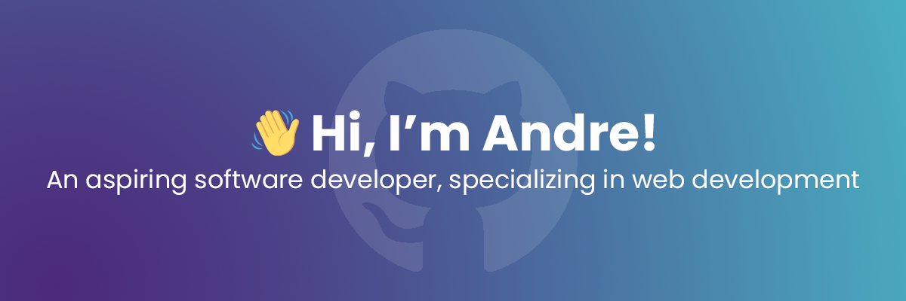

<!-- Header Image -->

  

## 🚀 Languages and Tools

<strong>Languages</strong>

  

<strong>Frameworks & Libraries</strong>

  

<strong>Developer Tools & IDEs</strong>

  

<strong>Design Tools</strong>

  

---

## 🌐 Connect with Me

  
  
  
  

---

## 📊 GitHub Stats

  

  

  

---

> *“Different is not better, better is different.”*

<!---
andre-floors/andre-floors is a ✨ special ✨ repository because its `README.md` (this file) appears on your GitHub profile.
You can click the Preview link to take a look at your changes.
--->
